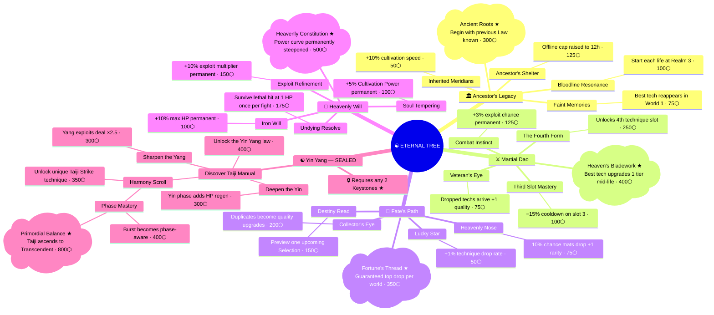

# Reincarnation — Transmigration System

> *"The body is ash. The soul remembers. The next life begins wiser."*

---

## Overview

**Transmigration** is the prestige mechanic. When a cultivator reaches the peak of Open Heaven and completes the final world region, they may willingly dissolve their physical form and reenter the cycle of reincarnation.

Everything built in this life — realm, qi, techniques, gear, materials — returns to the universe. What persists is the soul: the distilled understanding of a lifetime's cultivation, crystallised as **Karma**.

Karma is spent in the **Eternal Tree** — a permanent passive tree that grows across all lifetimes and shapes every future run.

Each transmigration also presents a **Soul Revelation**: a one-time choice of a single thing your soul carries forward as a memory into the next life.

---

## The Name

| Context | Term |
|---|---|
| The action | Transmigrate |
| The mechanic screen | Enter the Cycle |
| The currency | Karma |
| The tree | The Eternal Tree |
| Life counter display | "Second Life", "Veteran Soul" (3+), "Ancient Soul" (6+) |

---

## Gating — Who Can Transmigrate

Transmigration is **not available until the player has**:
1. Reached **Open Heaven** (realm index 50+, the peak tier)
2. Cleared at least **one region in World 6** (proven they reached the endgame)

This prevents players from endlessly resetting in early realms for marginal gains. The first life must be walked to its end.

A "Transmigrate" option appears on the Home screen only when both conditions are met, styled as a significant action — not a casual button.

---

## Karma — The Prestige Currency

Karma accumulates during a lifetime from meaningful achievements. It is **not awarded in bulk at transmigration** — it trickles in throughout the run so players always feel progress toward the tree.

### Earning Karma

| Source | Amount | Notes |
|---|---|---|
| Each realm breakthrough | 2 | 52 realms × 2 = 104 max |
| First clear of each world region | 15 | 23 regions × 15 = 345 max |
| Fully clearing a world (all regions) | 30 bonus | 6 worlds × 30 = 180 max |
| Each unique pill brewed (first time) | 2 | 46 pills × 2 = 92 max |
| Each unique technique discovered | 1 | Capped at 50 karma total |
| Each Selection picked | 1 | 52 selections × 1 = 52 max |
| Reaching Open Heaven | 100 | One-time per life |
| Clearing all 6 worlds | 100 | One-time per life |

### Karma Per Life (Estimates)

| Player type | Expected karma |
|---|---|
| Casual (reaches World 3, realm ~35) | 300–450 |
| Engaged (reaches World 5, realm ~45) | 550–750 |
| Full completion (all worlds, Open Heaven) | 900–1,050 |

### World Seed

Each life is generated with a **world seed** that governs which technique variants and rare material nodes appear in each region. Transmigrating generates a new seed — different drops, different technique rolls, different rare encounters. This rewards multiple runs with genuine discovery rather than pure repetition.

---

## What Is Erased

Everything physical. The soul carries only understanding, not possessions.

| Category | Status |
|---|---|
| Realm level | ❌ Reset to 0 (or 3 with Bloodline Resonance node) |
| Qi | ❌ Erased |
| Technique collection | ❌ Erased |
| Artefacts and gear | ❌ Erased |
| Active law | ❌ Erased (unless Soul Revelation: Path of Memory) |
| Pill permanent bonuses | ❌ Erased — pills are absorbed into that life's body, not the soul |
| Materials inventory | ❌ Erased |
| Cleared regions | ❌ Reset |
| Pending loot | ❌ Erased |
| Auto-farm assignments | ❌ Reset |
| Selections made | ❌ Reset |

---

## What Persists

| Category | Status |
|---|---|
| Karma (accumulated total) | ✅ Permanent |
| Eternal Tree unlocks | ✅ Permanent |
| Life counter and title | ✅ Permanent |
| Soul Revelation carry-forward | ✅ One item per transmigration (see below) |

---

## Soul Revelation — The Carry-Forward Choice

At the moment of transmigration, before the world resets, the player chooses **one** of four paths. This choice is permanent for that transition and cannot be changed.

| Path | What carries forward |
|---|---|
| **Path of Memory** | Your active Law is remembered. Next life begins with it already in your collection — no need to craft or discover it. |
| **Path of Art** | Your highest-quality technique is soul-bound. It appears as a guaranteed drop in World 1 within your first 20 fights. |
| **Path of Flesh** | Your two best artefacts are soul-echoed. They appear in your collection at the start of the next life, equipped automatically. |
| **Path of Wisdom** | You carry nothing material — instead gain a **+25% bonus** on all Karma earned this life, applied immediately before the reset. |

Path of Wisdom is the optimal choice for players racing to complete the Eternal Tree. The other paths are better for players who want a strong start to the next run.

---

## The Eternal Tree

The Eternal Tree has **four main branches** and **one sealed branch** that unlocks after deep investment. Nodes are purchased with Karma and are permanently unlocked across all future lives.

Nodes within a branch must be purchased in sequence. Cross-branch connector nodes require both adjacent branch nodes to be purchased first.

**Total tree cost: ~6,650 Karma** (~7–10 full lives to complete everything)

---

> **Cross-branch connectors** (require both adjacent keystones):
> - **Inherited Strength** `AL★ + HW` — 150⬡ — Legacy speed bonus scales Heavenly Will curve
> - **Technique Savant** `MD★ + FP★` — 200⬡ — Fortune's Thread also triggers a 2nd technique drop
> - **Phase Technique** `MD★ + YY` — 300⬡ — 4th slot can be Yin-only or Yang-only

---

## Branch Reference

### 🏛 Ancestor's Legacy
*"Those who walk the path again walk it faster."*
**Identity:** Quality-of-life. Makes early realms less tedious. Best first branch for most players.
**Total cost:** 650 Karma

| Node | Effect | Cost |
|---|---|---|
| Inherited Meridians | +10% cultivation speed (stacks per purchase, max 3×) | 50 |
| Faint Memories | Your best technique from the previous life auto-appears as a guaranteed World 1 drop within first 30 fights | 75 |
| Bloodline Resonance | Each life begins at Realm 3 instead of 1 | 100 |
| Ancestor's Shelter | Offline gains cap raised from 8h → 12h | 125 |
| **Ancient Roots ★** | Start each life with your previous Law already in your collection — no crafting required | 300 |

---

### ⚔ Martial Dao
*"The body forgets. The hands remember."*
**Identity:** Combat depth. Techniques are stronger, more plentiful, better rewarded.
**Total cost:** 950 Karma

| Node | Effect | Cost |
|---|---|---|
| Veteran's Eye | All dropped techniques arrive one quality tier higher than rolled | 75 |
| Third Slot Mastery | Technique slot 3 has −15% cooldown permanently | 100 |
| Combat Instinct | +3% exploit chance permanent | 125 |
| The Fourth Form | Unlocks a 4th technique slot | 250 |
| **Heaven's Bladework ★** | Once per life, when you cross the midpoint realm of your current tier, your highest-quality technique automatically upgrades one rarity tier | 400 |

---

### 🌟 Fate's Path
*"The heavens show favour to those who have already walked the road."*
**Identity:** Loot and discovery. Finds better things more often.
**Total cost:** 825 Karma

| Node | Effect | Cost |
|---|---|---|
| Lucky Star | +1% technique drop rate on all enemies | 50 |
| Heavenly Nose | 10% chance for any gathered/mined material to be one rarity tier higher | 75 |
| Destiny Read | Once per life, preview one of your next three Selection options before the breakthrough | 150 |
| Collector's Eye | When you receive a technique you already own at equal or lower quality, it converts to a quality upgrade for your existing copy instead | 200 |
| **Fortune's Thread ★** | Your first technique drop in each world is guaranteed to be the highest quality tier available in that world (W1 → Bronze, W6 → Transcendent) | 350 |

---

### 💪 Heavenly Will
*"The soul hardens with each death. What once broke you now bends."*
**Identity:** Raw permanent power. Every node makes the cultivator numerically stronger forever.
**Total cost:** 1,025 Karma

| Node | Effect | Cost |
|---|---|---|
| Soul Tempering | +5% Cultivation Power permanent (purchasable up to 5×, max +25%) | 100 |
| Iron Will | +10% max HP permanent | 100 |
| Undying Resolve | Once per fight, surviving a lethal hit leaves you at 1 HP instead of dying | 175 |
| Exploit Refinement | +10% exploit multiplier permanent | 150 |
| **Heavenly Constitution ★** | The Cultivation Power growth curve is steepened permanently — each realm breakthrough yields slightly more Power than the base formula | 500 |

---

### ☯ Yin Yang — The Sealed Branch
*"To master one side is strength. To master both is transcendence."*
**Unlock condition:** Any two branch keystones (★) must be purchased.
**Identity:** A unique law and technique obtainable *only* through the Eternal Tree. The reward for veteran players.
**Total cost:** 2,550 Karma (branch only)

The **Taiji Manual** is a law of perfect duality. In combat, the cultivator's state alternates between two phases every 10 seconds:
- **Yin Phase** — incoming damage reduced 20%, DoT applied to enemy each turn
- **Yang Phase** — outgoing damage +30%, exploit chance doubled

| Node | Effect | Cost |
|---|---|---|
| Discover the Taiji Manual | The Yin Yang law is added to your collection permanently. It begins at Iron rarity. Phase switching is the core mechanic. | 400 |
| Deepen the Yin | Yin phase now also regenerates +3% HP per second | 300 |
| Sharpen the Yang | Yang phase exploit procs deal ×2.5 instead of ×1.5 | 300 |
| The Harmony Scroll | Unlocks **Taiji Strike** — a unique technique not in any drop pool. Its passive: 15% of Yang phase damage converts to healing in the next Yin phase | 350 |
| Phase Mastery | Your Burst becomes phase-aware: triggered during Yang phase it deals maximum damage; triggered during Yin phase it grants 5 seconds of full damage immunity | 400 |
| **Primordial Balance ★** | The Taiji Manual permanently ascends to Transcendent rarity and gains a 6th passive slot: *Perfect Cycle* — a killing blow landed in Yang phase does not switch to Yin; Yang phase continues | 800 |

---

### Cross-Branch Connectors

These nodes sit between two branches and require both adjacent keystones to be purchased first.

| Node | Requires | Effect | Cost |
|---|---|---|---|
| **Inherited Strength** | Ancient Roots ★ + Soul Tempering | Ancestor's Legacy cultivation speed bonus also scales the Heavenly Constitution power curve | 150 |
| **Technique Savant** | Heaven's Bladework ★ + Fortune's Thread ★ | Fortune's Thread's guaranteed world drop also triggers a second technique drop from the same fight | 200 |
| **Phase Technique** | Heaven's Bladework ★ + Phase Mastery | The 4th technique slot can be designated Yin-only or Yang-only — it fires exclusively during its assigned phase | 300 |

---

## Progression Pacing

| Lives completed | Likely tree progress |
|---|---|
| Life 1 | 2–4 early nodes in one branch (~300–450 karma) |
| Life 2–3 | First keystone reachable; Yin Yang branch still inaccessible |
| Life 4–5 | Second branch progressing; first cross-branch connector available |
| Life 6–7 | Two keystones owned; Yin Yang sealed branch unlocks |
| Life 8–10 | Yin Yang branch completion; most cross-branch nodes purchased |
| Life 12–15 | Full tree complete; endgame prestige loop |

---

## Transmigration Screen — UX Intent

The transmigration screen should feel like a chapter ending, not a settings menu. Suggested flow:

1. **Dissolve** — full-screen animation of the cultivator's body becoming light
2. **Life Summary** — realm reached, worlds cleared, techniques mastered, karma earned this life
3. **Soul Revelation** — choose one of the four paths (Path of Memory / Art / Flesh / Wisdom)
4. **Eternal Tree** — spend accumulated karma (optional, can be deferred)
5. **Rebirth** — realm counter falls to 0, world seed changes, new life begins

The life counter in the player's title should update visibly. "You were a mortal. You are now in your Second Life."

---

## Related

- [[Cultivation System]]
- [[Laws]]
- [[Combat]]
- [[Realm Progression]]
- [[Game Vision]]
